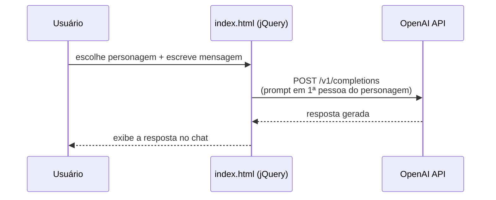

<div align="center">

# 🕰️ NostalgiaGPT — Converse com a História

**Um chat onde você conversa, em primeira pessoa, com personalidades históricas.**
*A chat where you talk, in first person, with historical figures.*


🇧🇷 [**Português**](#-português) · 🇺🇸 [**English**](#-english)

</div>

---

## 🇧🇷 Português
<a name="-português"></a>

### O que é

**NostalgiaGPT** é um chat interativo, de página única, que permite conversar com **figuras históricas famosas** — de Albert Einstein a Cleópatra, de Ayrton Senna a Shakespeare. Você escolhe a personalidade num menu suspenso, escreve sua mensagem e a IA responde **em primeira pessoa**, assumindo a voz e o estilo do personagem (inclusive simulando emoções com emojis).

A interface é leve e nostálgica: um cartão de chat com avatar do personagem, efeito de hero "borrado/revelado" (**Brusher**), rolagem customizada (malihu) e tudo movido por **jQuery** puro. As respostas vêm da **API da OpenAI**, chamada diretamente do navegador.

### O problema que resolve

- **Educação que diverte:** uma forma lúdica de explorar como pensariam grandes nomes da história.
- **Sem build, sem servidor:** é só HTML/CSS/JS — abre direto no navegador.

### ✨ Funcionalidades

- 💬 **Chat com 40+ personalidades** históricas, selecionáveis num dropdown.
- 🎭 **Respostas em primeira pessoa** geradas por IA, simulando a voz do personagem.
- 🖼️ **Avatares** dos personagens (pasta `persons/`).
- 🎨 **Efeito visual Brusher** na home e **scrollbar customizada**.
- 🪶 **Stack mínima:** HTML + CSS + JavaScript + jQuery, sem etapa de build.

### 🗿 Personalidades disponíveis

Einstein, Alexandre o Grande, Aristóteles, Ayrton Senna, Beethoven, Buda, Darwin, Che Guevara, Cândido Rondon, Cleópatra, Confúcio, Dom Pedro II, Edgar Allan Poe, Eleanor Roosevelt, Elis Regina, Elvis, Hemingway, Galileu, Gandhi, Washington, Getúlio Vargas, Villa-Lobos, Newton, Jane Austen, Jesus Cristo, Bach, Kennedy, Da Vinci, Machado de Assis, Martin Luther King Jr., Michelangelo, Napoleão, Mandela, Tesla, Picasso, Platão, Princesa Diana, Robin Hood, Dalí, Shakespeare, Freud, Steve Jobs, Edison, Van Gogh, Churchill — e mais.

### 🚀 Como rodar

```bash
git clone https://github.com/caioross/NostalgiaGPT.git
# Abra o index.html no navegador
```

1. Selecione a personalidade no menu suspenso.
2. Escreva sua mensagem e clique em **Enviar**.
3. A personalidade responde com texto gerado por IA.

### 🔑 Configurar a API da OpenAI

O projeto chama a OpenAI a partir do `js/mainJs.js`. Você precisa de uma chave de API:

1. Crie uma conta em [openai.com](https://www.openai.com/) e gere sua chave.
2. Em `js/mainJs.js`, localize o cabeçalho `Authorization` na função `insertMessage` e informe sua chave.

> ⚠️ **Atenção de segurança:** colocar a chave da OpenAI direto no JavaScript do front-end **expõe a chave** a qualquer visitante (e o endpoint/modelo usado, `text-davinci-003`, é legado). Para produção, coloque a chamada atrás de um **backend/proxy** e nunca versione a chave (o `.gitignore` já ignora `.env` e `config.js`).

### 📁 Estrutura

```
NostalgiaGPT/
├── index.html              # interface do chat + seletor de personalidades
├── css/styles.css
├── js/mainJs.js            # lógica do chat e chamada à OpenAI (jQuery)
├── brusher-demo.min.js/css # efeito visual de hero
├── images/                 # arte da home, separadores, ícones
└── persons/                # avatares dos personagens (.jpg)
```

### 🔄 Fluxo da conversa



---

## 🇺🇸 English
<a name="-english"></a>

### What it is

**NostalgiaGPT** is an interactive, single-page chat that lets you talk to **famous historical figures** — from Albert Einstein to Cleopatra, Ayrton Senna to Shakespeare. Pick a personality from a dropdown, type your message, and the AI replies **in first person**, taking on the figure's voice and style (even simulating emotions with emojis).

The interface is light and nostalgic: a chat card with the figure's avatar, a blur/reveal **Brusher** hero effect, a custom scrollbar (malihu), all driven by plain **jQuery**. Replies come from the **OpenAI API**, called directly from the browser.

### The problem it solves

- **Education that entertains:** a playful way to explore how great historical minds might think.
- **No build, no server:** it's just HTML/CSS/JS — open it straight in the browser.

### ✨ Features

- 💬 **Chat with 40+ historical figures**, selectable from a dropdown.
- 🎭 **First-person AI replies** mimicking each figure's voice.
- 🖼️ **Avatars** for each figure (`persons/` folder).
- 🎨 **Brusher hero effect** and a **custom scrollbar**.
- 🪶 **Minimal stack:** HTML + CSS + JavaScript + jQuery, no build step.

### 🚀 Getting started

```bash
git clone https://github.com/caioross/NostalgiaGPT.git
# Open index.html in your browser
```

### 🔑 OpenAI API setup

The app calls OpenAI from `js/mainJs.js`. Add your API key in the `Authorization` header inside `insertMessage`.

> ⚠️ **Security note:** putting the OpenAI key directly in front-end JavaScript **exposes it** to every visitor (and the model used, `text-davinci-003`, is legacy). For production, move the call behind a **backend/proxy** and never commit the key (the `.gitignore` already ignores `.env` and `config.js`).

### 📁 Structure

```
NostalgiaGPT/
├── index.html              # chat UI + personality selector
├── css/styles.css
├── js/mainJs.js            # chat logic + OpenAI call (jQuery)
├── brusher-demo.min.*      # hero visual effect
├── images/                 # home art, separators, icons
└── persons/                # figure avatars (.jpg)
```

---

<div align="center">

*Parte do ecossistema de projetos de **Caio**.*

</div>
