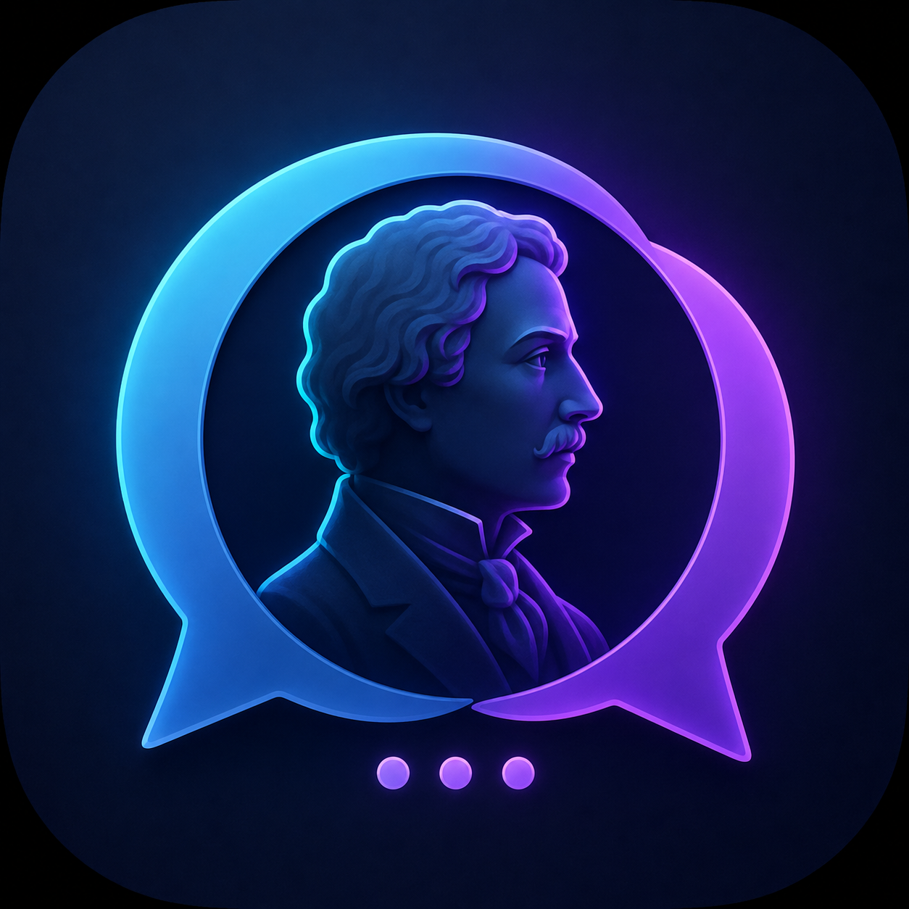
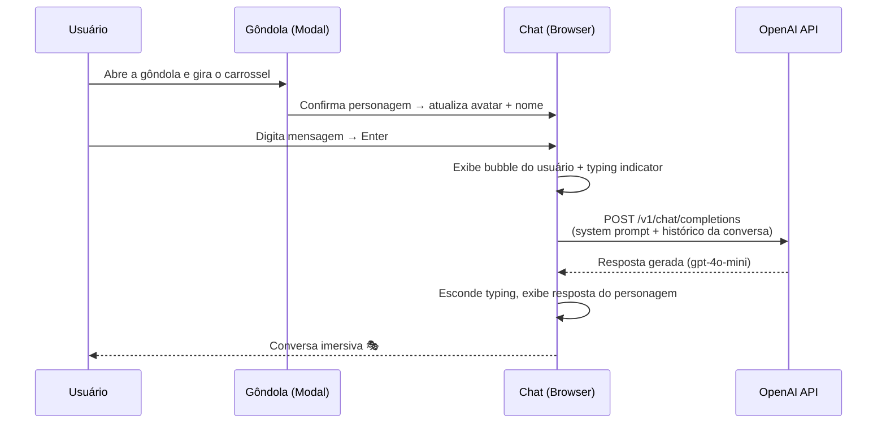

<div align="center">



# NostalgiaGPT

**Converse em primeira pessoa com as maiores mentes da história.**  
*Talk in first person to the greatest minds in history.*

<br/>

[](https://caioross.github.io/NostalgiaGPT/)

<br/>

[](https://developer.mozilla.org/pt-BR/docs/Web/HTML)
[](https://developer.mozilla.org/pt-BR/docs/Web/CSS)
[](https://developer.mozilla.org/pt-BR/docs/Web/JavaScript)
[](https://jquery.com)
[](https://platform.openai.com)

[](LICENSE)
[]()
[]()
[]()

<br/>

🇧🇷 [**Português**](#-português) · 🇺🇸 [**English**](#-english)

</div>

---

<div align="center">
  
</div>

---

## 🇧🇷 Português

🔗 **Acesse ao vivo:** [caioross.github.io/NostalgiaGPT](https://caioross.github.io/NostalgiaGPT/) — experimente sem instalar nada.

### O que é

**NostalgiaGPT** é uma aplicação web de página única que permite conversar — em primeira pessoa — com **mais de 40 personalidades históricas** famosas. Escolha entre Einstein, Cleópatra, Tesla, Gandhi, Shakespeare, Newton e dezenas de outros; escreva sua mensagem; e a IA responde *como se fosse aquele personagem*, com a voz, o estilo e as emoções dele.

A interface tem um design vintage atmosférico: paleta escura com acentos dourados, tipografia serif elegante, efeito sepia nos avatares e animações sutis — tudo pensado para criar imersão e nostalgia. Sem backend, sem build, sem cadastro. É só HTML + CSS + JS.

---

### ✨ Funcionalidades

| Recurso | Descrição |
|---|---|
| 🎭 **47 personalidades** | Organizadas em 6 categorias: Ciência, Arte, Filosofia, Líderes, Música e Lendas |
| 🎡 **Gôndola de seleção** | Carrossel imersivo em *coverflow 3D* com busca e filtros por categoria |
| 🤖 **IA em primeira pessoa** | Respostas via OpenAI (`gpt-4o-mini`) simulando a voz e o estilo de cada personagem |
| 🧠 **Memória de conversa** | A IA lembra do contexto do diálogo enquanto você conversa |
| 🖼️ **Fotos + Monogramas** | Fotos reais com efeito sepia; quem não tem foto ganha um monograma elegante por categoria |
| 💬 **Typing indicator** | Animação com avatar enquanto o personagem "pensa" antes de responder |
| ✨ **Perguntas sugeridas** | Chips de partida para quebrar o gelo com cada personagem |
| 🎨 **Design imersivo** | Tema escuro vintage, acentos dourados, tipografia Cinzel + Lora |
| 🖱️ **Galeria categorizada** | Clique em qualquer card para começar a conversar na hora |
| 💾 **Lembra de você** | O último personagem escolhido fica salvo (localStorage) |
| ♿ **Acessível** | Semântica ARIA, navegação por teclado, foco gerenciado no modal |
| 📱 **Responsivo** | Funciona em mobile, tablet e desktop |
| ⚡ **Zero build** | Abra o `index.html` direto no navegador |

---

### 🗿 Personalidades disponíveis

As 47 personalidades estão organizadas em **6 categorias**, cada uma com sua cor temática nos monogramas:

<details>
<summary><strong>Ver todas as 47 personalidades</strong></summary>

**🔬 Ciência & Tecnologia**
> Albert Einstein · Isaac Newton · Nikola Tesla · Thomas Edison · Charles Darwin · Galileu Galilei · Steve Jobs

**🎨 Arte & Literatura**
> Leonardo da Vinci · Michelangelo · Pablo Picasso · Van Gogh · Shakespeare · Edgar Allan Poe · Ernest Hemingway · Jane Austen · Machado de Assis · Salvador Dalí

**📜 Filosofia & Fé**
> Platão · Aristóteles · Confúcio · Buda · Jesus Cristo · Sigmund Freud · Vicente de Paulo

**⚔️ Líderes & Política**
> Mahatma Gandhi · Napoleão Bonaparte · George Washington · John F. Kennedy · Nelson Mandela · Winston Churchill · Che Guevara · Martin Luther King Jr. · Eleanor Roosevelt · Dom Pedro II · Getúlio Vargas · Alexandre, o Grande · Cleópatra · Cândido Rondon

**🎼 Música**
> Ludwig van Beethoven · Johann Sebastian Bach · Elvis Presley · Elis Regina · Heitor Villa-Lobos

**⭐ Esporte & Lendas**
> Ayrton Senna · Claudio Coutinho · Princesa Diana · Robin Hood

</details>

---

### 🚀 Como rodar

```bash
# 1. Clone o repositório
git clone https://github.com/caioross/NostalgiaGPT.git
cd NostalgiaGPT

# 2. Abra no navegador (sem servidor necessário)
# — clique duplo em index.html, ou:
npx serve .
```

Pronto. A página abre e você já pode usar a interface.

> **Para as respostas da IA funcionarem**, você precisa configurar sua chave da OpenAI — veja a seção abaixo.

---

### 🔑 Configurar a API da OpenAI

1. Crie uma conta em [platform.openai.com](https://platform.openai.com) e gere sua chave de API.
2. Abra `js/mainJs.js` e, no topo do arquivo, localize a constante:

```javascript
var OPENAI_KEY   = 'SUA_CHAVE_OPENAI_AQUI';
var OPENAI_MODEL = 'gpt-4o-mini';
```

3. Substitua `SUA_CHAVE_OPENAI_AQUI` pela sua chave (ex.: `sk-proj-...`). Pronto!

> O app usa a **API de Chat Completions** com o modelo `gpt-4o-mini` (rápido e econômico). Quer trocar? Basta mudar `OPENAI_MODEL` para `gpt-4o`, `gpt-3.5-turbo` etc.

> [!WARNING]
> **Segurança:** colocar a chave diretamente no JavaScript expõe ela a qualquer pessoa que inspecionar o código-fonte. Isso é **aceitável para uso pessoal/local**, mas **não para produção pública**. Para deployar em produção, mova a chamada para um backend/proxy e **nunca versione a chave** (o `.gitignore` já bloqueia `.env` e `config.js`).

---

### 📁 Estrutura

```
NostalgiaGPT/
│
├── index.html              # App completo — hero, chat, gôndola, galeria, footer
├── css/
│   └── styles.css          # Tema vintage escuro, coverflow 3D, monogramas, responsivo
├── js/
│   ├── personalities.js    # Data model: 47 personagens, 6 categorias, helpers
│   └── mainJs.js           # Lógica: chat (OpenAI), modal gôndola, avatares, partículas
│
├── persons/                # Fotos das personalidades (.jpg) — as demais usam monograma
│   ├── Albert Einstein.jpg
│   ├── Ayrton Senna.jpg
│   ├── Cleópatra.jpg
│   ├── Isaac Newton.jpg
│   ├── Jesus Cristo.jpg
│   ├── Nikola Tesla.jpg
│   ├── Pablo Picasso.jpg
│   └── Thomas Edison.jpg
│
├── images/                 # Assets visuais (hero, separadores)
├── icon.png                # Favicon / logo do projeto
└── .gitignore
```

> 💡 **Quer adicionar um personagem?** Basta acrescentar um objeto em `js/personalities.js` (nome, categoria, anos, tagline e foto opcional). A galeria e a gôndola se atualizam sozinhas.

---

### 🔄 Fluxo da conversa



---

### 🛠️ Tech Stack

| Camada | Tecnologia |
|---|---|
| **Frontend** | HTML5 semântico + CSS3 (custom properties, animations, grid, 3D transforms) |
| **JavaScript** | Vanilla JS + jQuery 2.2.4 |
| **Tipografia** | Google Fonts — Cinzel (títulos) · Lora (corpo) |
| **IA** | OpenAI API — Chat Completions, modelo `gpt-4o-mini` |
| **Build** | Nenhum — arquivos servidos diretamente |
| **Deploy** | GitHub Pages (ou qualquer servidor estático) |

---

### 🤝 Contribuindo

Contribuições são muito bem-vindas!

```bash
# Fork → clone → branch
git checkout -b feature/nova-personalidade

# Faça suas alterações e commit
git commit -m "feat: adiciona personalidade X"

# Abra um Pull Request
```

**Ideias de contribuição:**
- Adicionar novas personalidades em `js/personalities.js`
- Adicionar fotos faltantes na pasta `persons/` (substituindo monogramas)
- Criar modo claro alternável
- Streaming das respostas (Server-Sent Events)
- Histórico de conversa persistente entre sessões
- Áudio: ler as respostas em voz alta (Web Speech API)

---

### 📄 Licença

Distribuído sob a [licença MIT](LICENSE). Use, modifique e distribua à vontade.

Código de terceiros redistribuído aqui — como o **Brusher** (MIT, de Kamran Ahmed),
responsável pelo efeito de fundo esfumaçado — está creditado em
[ATTRIBUTION.md](ATTRIBUTION.md).

---

<div align="center">

*Criado com ♥ por **[Caio Ross](https://github.com/caioross)***

</div>

---

## 🇺🇸 English

🔗 **Live demo:** [caioross.github.io/NostalgiaGPT](https://caioross.github.io/NostalgiaGPT/) — try it with nothing to install.

### What it is

**NostalgiaGPT** is a single-page web app that lets you converse — in first person — with **47 famous historical figures**. Pick from Einstein, Cleopatra, Tesla, Gandhi, Shakespeare, Newton, and dozens more through an immersive 3D carousel; type your message; and the AI responds *as that character*, with their voice, style, and emotions.

The interface features an atmospheric vintage design: dark palette with gold accents, elegant serif typography, sepia avatar filters, and subtle animations — all crafted to create immersion. No backend, no build step, no account required. Just HTML + CSS + JS.

---

### ✨ Features

| Feature | Description |
|---|---|
| 🎭 **47 personalities** | Organized into 6 categories: Science, Art, Philosophy, Leaders, Music & Legends |
| 🎡 **The "Gondola" picker** | Immersive *3D coverflow* carousel with search and category filters |
| 🤖 **First-person AI replies** | OpenAI (`gpt-4o-mini`) responses mimicking each figure's voice and style |
| 🧠 **Conversation memory** | The AI keeps context throughout your dialogue |
| 🖼️ **Photos + Monograms** | Real photos with sepia; figures without one get an elegant category-colored monogram |
| 💬 **Typing indicator** | Avatar animation while the character "thinks" before responding |
| ✨ **Suggested prompts** | Starter chips to break the ice with each character |
| 🎨 **Immersive design** | Dark vintage theme, gold accents, Cinzel + Lora typography |
| 🖱️ **Categorized gallery** | Click any card to start chatting instantly |
| 💾 **Remembers you** | Your last chosen character is saved (localStorage) |
| ♿ **Accessible** | ARIA semantics, keyboard navigation, managed modal focus |
| 📱 **Responsive** | Works on mobile, tablet, and desktop |
| ⚡ **Zero build step** | Just open `index.html` in a browser |

---

### 🚀 Getting started

```bash
# 1. Clone the repo
git clone https://github.com/caioross/NostalgiaGPT.git
cd NostalgiaGPT

# 2. Open in your browser (no server needed)
# — double-click index.html, or:
npx serve .
```

> **For AI responses to work**, you need an OpenAI API key — see the section below.

---

### 🔑 OpenAI API setup

1. Create an account at [platform.openai.com](https://platform.openai.com) and generate an API key.
2. Open `js/mainJs.js` and, at the top of the file, find:

```javascript
var OPENAI_KEY   = 'SUA_CHAVE_OPENAI_AQUI';
var OPENAI_MODEL = 'gpt-4o-mini';
```

3. Replace `SUA_CHAVE_OPENAI_AQUI` with your key (e.g. `sk-proj-...`). Done!

> The app uses the **Chat Completions API** with `gpt-4o-mini` (fast and cheap). Want a different one? Just change `OPENAI_MODEL` to `gpt-4o`, `gpt-3.5-turbo`, etc.

> [!WARNING]
> **Security:** Placing the key directly in front-end JavaScript exposes it to anyone who inspects your source. This is **fine for personal/local use**, but **not for public production**. For deployment, move the call behind a backend/proxy and **never commit your key** (`.gitignore` already blocks `.env` and `config.js`).

---

### 📁 Structure

```
NostalgiaGPT/
│
├── index.html              # Full app — hero, chat, gondola, gallery, footer
├── css/
│   └── styles.css          # Vintage dark theme, 3D coverflow, monograms, responsive
├── js/
│   ├── personalities.js    # Data model: 47 figures, 6 categories, helpers
│   └── mainJs.js           # Logic: chat (OpenAI), gondola modal, avatars, particles
│
├── persons/                # Personality photos (.jpg) — the rest use monograms
├── images/                 # Visual assets (hero, separators)
├── icon.png                # Favicon / project logo
└── .gitignore
```

> 💡 **Want to add a figure?** Just add an object to `js/personalities.js` (name, category, years, tagline, optional photo). The gallery and gondola update automatically.

---

### 📄 License

Distributed under the [MIT License](LICENSE). Use, modify, and distribute freely.

Third-party code redistributed here — such as **Brusher** (MIT, by Kamran Ahmed),
which powers the blurred background effect — is credited in
[ATTRIBUTION.md](ATTRIBUTION.md).

---

<div align="center">

*Part of **[Caio Ross](https://github.com/caioross)**'s project ecosystem.*

</div>
